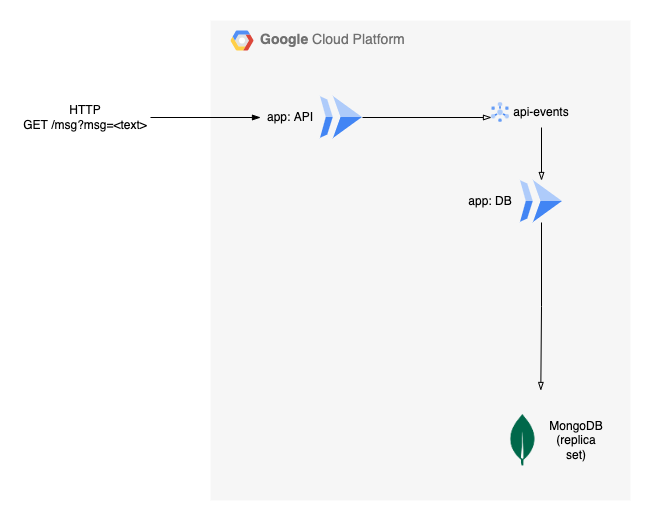

# GCP Cloud Run Pub/Sub Example

This is an example serverless application running on GCP Cloud Run and using
MongoDB as a database:



The application consists of a publisher (`app: API`) and a subscriber
(`app: DB`), which publish and read from a GCP Pub/Sub topic (`api-events`). The
`app` components are containers in GCP Cloud Run. The DB application stores data
received from the topic into MongoDB.

The infrastructure is defined in the [terraform/](terraform) directory.

The applications are TypeScripts in the [app/](app) directory.

The application container images can be built using the provided
[scripts/](scripts).

## Build

The build script requires a few environment variables to be set:

```sh
export CLOUDSDK_CORE_PROJECT="<gcp project id>"
```

Build API:

```sh
pushd app/api
../../scripts/gcloud-build.sh api
popd
```

Build DB:

```sh
pushd app/db
../../scripts/gcloud-build.sh db
popd
```

Use the built image tags to populate the relevant Terraform variables (see
below).

## Infrastructure

Infrastructure is managed with Terraform.

The following TF_VARs are required:

- `project`: GCP project ID
- `container_image_api`: container image tag for the API application (in GCP
  Artifact Registry)
- `container_image_db`: container image tag for the DB application (in GCP
  Artifact Registry)
- `mongodb_host`: MongoDB hostname (also see the other declared `mongodb_*`
  variables to configure the full connection string)

To deploy, run:

```sh
cd terraform
terraform apply
```

## Authors

**Andre Silva** - [@andreswebs](https://github.com/andreswebs)

## License

This project is licensed under the [Unlicense](UNLICENSE.md).
