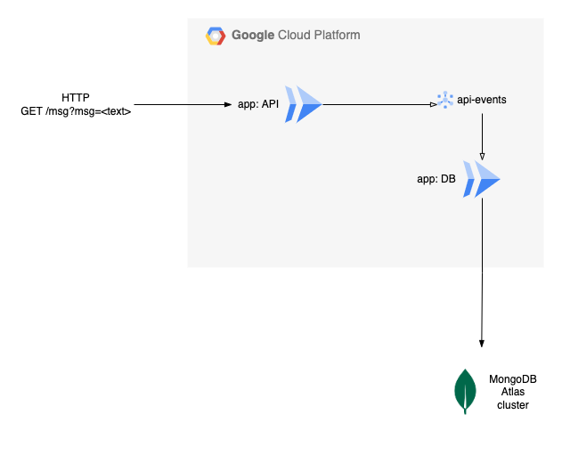

# Serverless GCP Pub/Sub Example

This is an example serverless application running on GCP Cloud Run and using
MongoDB Atlas as a database:

The application consists of a publisher (`app: API`) and a subscriber
(`app: DB`), which publish and read from a topic (`api-events`). The `app`
components are containers in GCP Cloud Run. The DB application stores data
received from the topic to MongoDB Atlas.

The infrastructure is defined in the [terraform/](terraform) directory.

The applications are TypeScripts in the [app/](app) directory.

The application container images can be built using the provided
[scripts/](scripts).

## Pre-requisites

1. Generate API credentials to access MongoDB Cloud (in 'Access Manager',
   'Organization Access', 'Create API Key')

2. Store the private key in GCP Secret Manager. Default secret name:
   `mongodb-atlas-key`

3. Save the public key in the TF_VAR (or `terraform.tfvars`):
   `mongodb_atlas_pubkey`

Note: the MongoDB Atlas API private key will be written in plaintext to the TF
state file.

## Configuration

The following TF_VARs are required:

- `project`: GCP project ID
- `mongodb_atlas_org_id`: MongoDB Atlas organization ID
- `mongodb_atlas_host`: The hostname of the MongoDB Atlas cluster
- `mongodb_atlas_pubkey` The MongoDB cloud API access public key
- `container_image_api`: container image tag for the API application
- `container_image_db`: container image tag for the DB application

### MongoDB Atlas:

This project does not create a MongoDB Atlas cluster. That must be created
manually in the Atlas console. This is because it is not possible to create a
free-tier cluster with the `mongodb/mongodbatlas` Terraform provider.

To deploy using Atlas free-tier, the first Terraform run will fail, until a
free-tier cluster is created manually.

## TODO:

- HTTP load balancer
- Cloud Run static outbound IP address (+ whitelist in Atlas)

## Authors

**Andre Silva** - [@andreswebs](https://github.com/andreswebs)

## License

This project is licensed under the [Unlicense](UNLICENSE.md).
